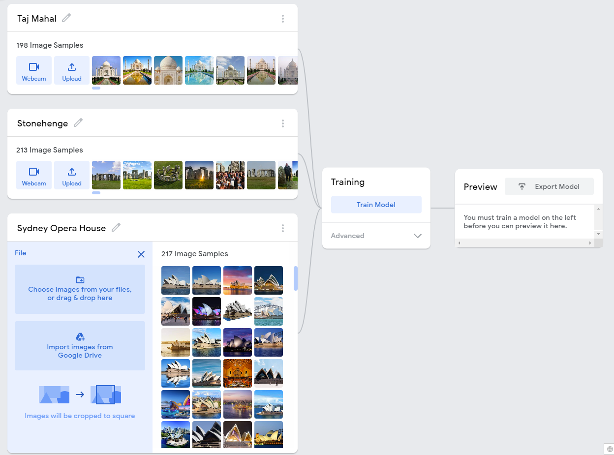

## Introduction

Create your own machine vision model and Python application to identify a user's images.

### What you will make
You will combine a model you have trained with Google's Teachable Machine and a Python program you have created on your computer. The application you build could either:

 + Take a picture with a user's webcam and classify it, then share that classification with the user
 + Take an image file provided by the user and classify it, then share that classification with the user

### What you will learn
You will learn:
 + To build and train a model with Teachable Machine
 + What to consider when providing training data to a model
 + How to connect a model with a Python program you've made

### What you should know
To do this project, you should be familiar with:
 + How to interact with a machine vision model, as covered in the ['Testing your computer’s vision' project](https://projects.raspberrypi.org/en/projects/testing-your-computers-vision)
 + How to create and use variables, lists, conditional statements, and functions in Python

--- collapse ---
---
title: What you will need
---
### Hardware

+ A computer with an internet connection

### Software

+ Python 3
+ The `pip` Python package installer (usually included with Python 3), and permission to install Python packages on your computer
+ A Google account

--- /collapse ---

--- collapse ---
---
title: Additional information for educators
---

If you need to print this project, please use the [printer-friendly version](https://projects.raspberrypi.org/en/projects/amazing-image-identifier/print){:target="_blank"}.

--- /collapse ---
