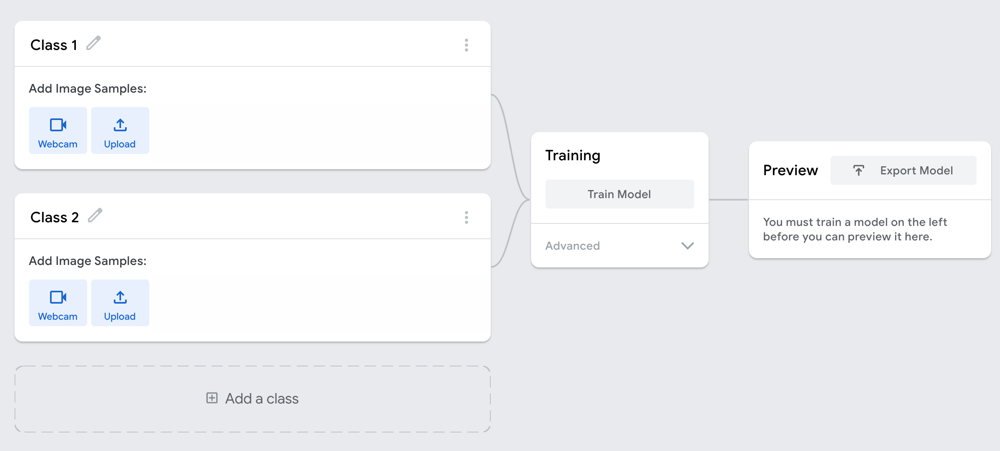
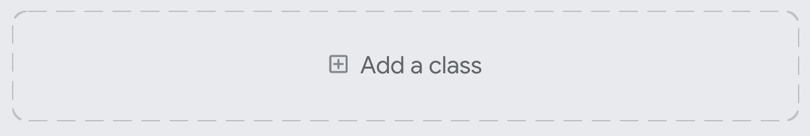

## Get started with Teachable Machine

This project has two parts to it: building a model on Teachable Machine, and then using that model in a game you'll build on your computer. Teachable Machine is a tool made by Google that creates machine learning models in your browser. You'll create a model to recognise images, but it can also create models that recognise sounds, or body poses.

--- task ---

Open the [Teachable Machine image model training page](https://teachablemachine.withgoogle.com/train/image){:target="_blank"} in a new tab in your browser.

--- /task ---

This is an untrained model, with two classes. Of course, since you need to recognise 'rock', 'paper', and 'scissors', you're going to need three classes.

--- task ---

Click the **Add a class** button to add a third class to your model.

--- /task ---

Next, give your classes proper labels that match what they're going to be trained to recognise.

--- task ---

Use the pencil beside each class name to rename them as follows:

  + Change 'Class 1' to 'rock'
  + Change 'Class 2' to 'paper'
  + Change 'Class 3' to 'scissors'

It's important to match this order, because some of the code provided to help your game run assumes that the classes are ordered like this.

--- /task ---

Now you're ready to record some training data.
