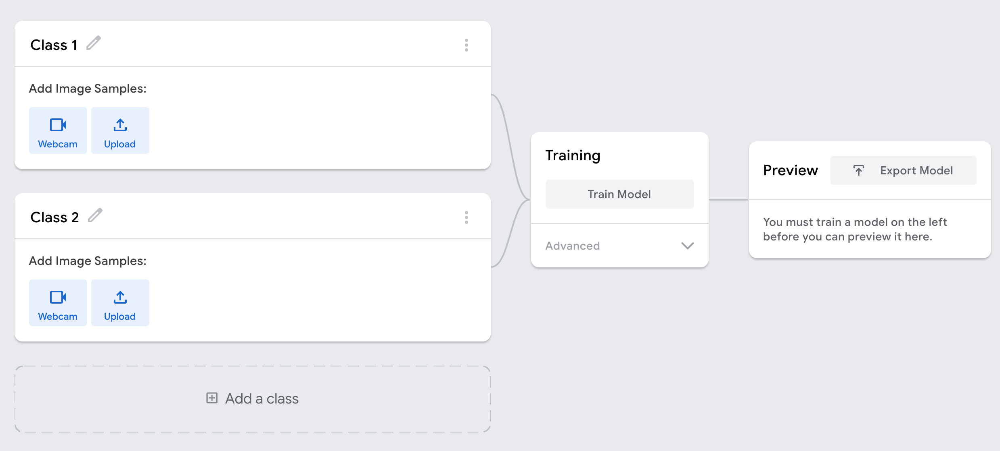
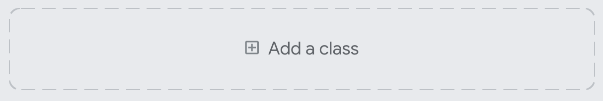
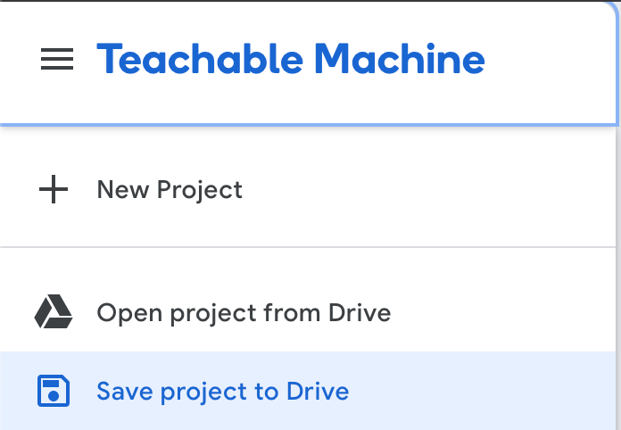
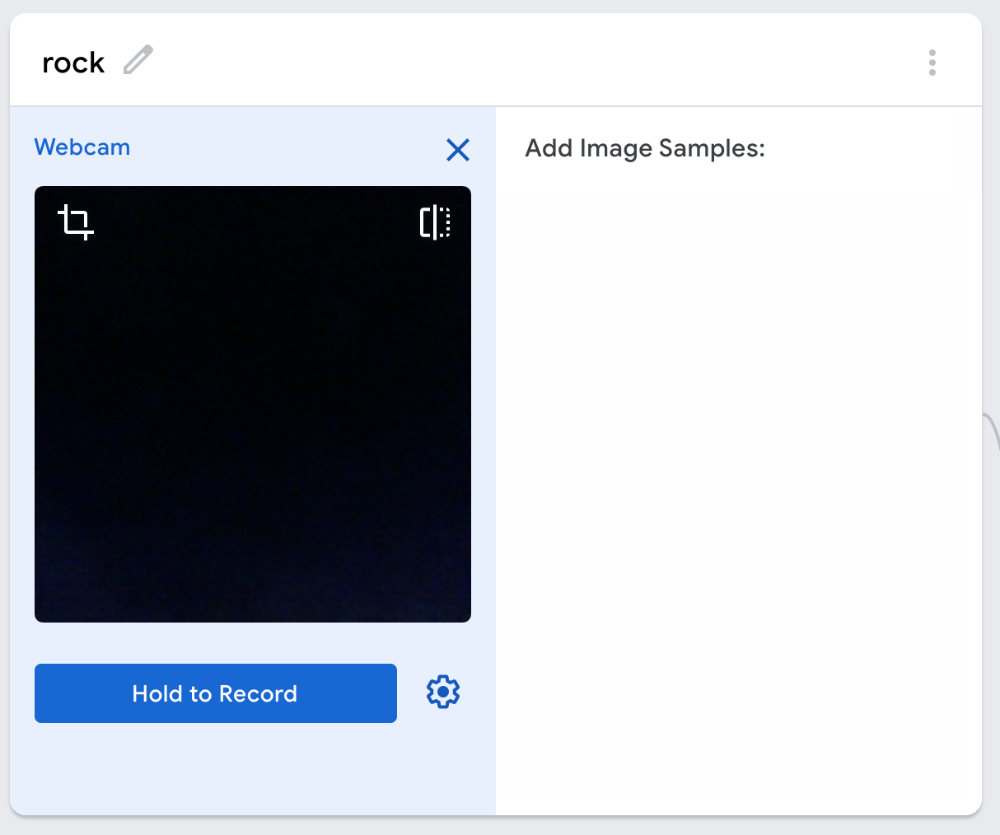
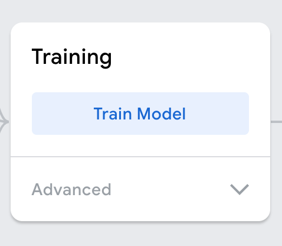
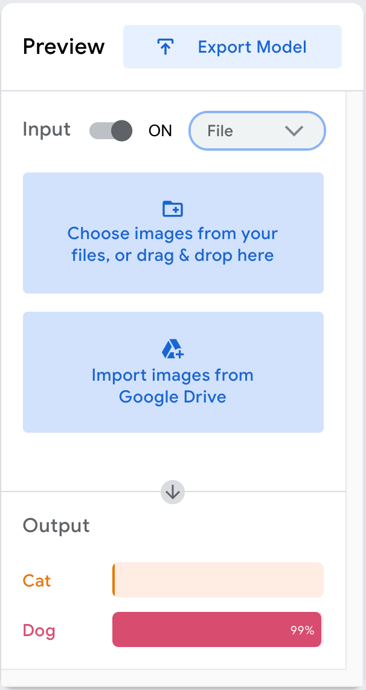
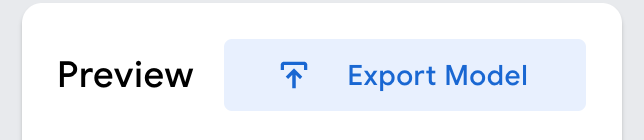
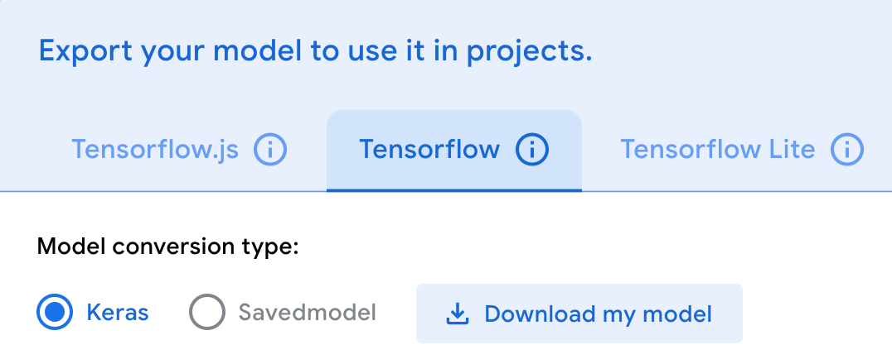

## Make your model

This project has two parts to it. First, build a model on Teachable Machine, then use that model in an application built on your computer. Teachable Machine is a tool made by Google that creates machine learning models in your browser. You can use it to create a model to recognise images, but it can also create models that recognise sounds or body poses.

### Create a model with classes
Before you start to train a model, you need to decide how many different classes of image your model is able to recognise. You have to provide training data for each of these classes, so make sure you don't pick too large a number. Maybe start with fewer than five classes and add more once you those ones work (if you need to).

--- collapse ---
---
title: Create a Teachable Machine model
---

To get started, open the [Teachable Machine image model training page](https://teachablemachine.withgoogle.com/train/image){:target="_blank"} in a new tab in your browser.

This is an untrained model with two classes, so it is able to recognise two things. You should use the pencil beside each class name to rename them, so they describe the things they recognise.

--- /collapse ---

--- collapse ---
---
title: Add more classes to your model
---

You can add additional classes if you want your model to be able to recognise more than two things. Click the **Add a class** button to add a third class to your model.

--- /collapse ---

--- collapse ---
---
title: Save your model
---
Once you have changed something in your model, you can save it. To do this, use the menu in the top left-hand corner of the Teachable Machine window. Open it and click on the 'Save project to Drive' option. You need to be logged into a Google account to do this.

--- /collapse ---

### Train your model
To train the model you have created, you need to provide it with data for each of its classes. Teachable Machine gives you two options: you can record data with your computer's webcam or upload images from your computer or Google Drive.

When you provide training images for your model, there are some things you should consider:

 + Make sure that the only thing that changes between your training images is the object you want the model to focus on, for example, a specific hand gesture or whether someone is wearing a hat. Alternatively, make sure the training images come from a wide variety of contexts. You should avoid a situation where the images for one class have, for example, a blue wall in the background, while the images for another class are all taken outdoors in a park. The model may incorrectly learn ‘blue wall’ or ‘green grass’ as the clues to identify the classes, rather than the specific features you want it to learn.
 + For similar reasons, if you try to teach the model to recognise a gesture or something about a person's appearance (if they wear a hat, their hair colour, etc.), then you should make sure you either use the same person for all of your training data or, ideally, use a wide variety of people in the training data for every class. Models that are trained on one gender, ethnicity, age group, or any other group of people that are visually similar, are weaker than those trained on groups of people that are visually distinct. Likewise, if you teach the computer to recognise if someone wears a hat, it will learn better if shown many hats in different colours. The general rule is to try to expose the computer to the class you are trying to teach it in as many contexts as you can think of — within the limits of what is safe and practical for you to do!

You have to provide images for each of the classes in your model separately. This means that you can record images for one class with your webcam while you upload existing images for another class, if you have a collection of such images available.

--- collapse ---
---
title: Record images with your computer's camera
---
If you have a Raspberry Pi with a camera, once you have [set up the camera](https://projects.raspberrypi.org/en/projects/getting-started-with-picamera) it can function as a webcam.

Click on the **Webcam** button for the class you want to train to show the webcam the control images.

You should see the class expand to show a preview from your computer's camera (you may need to grant the Teachable Machine website permission to access your camera) and a **Hold to Record** button.

If you click on the cog beside the **Hold to Record** button, you can set Teachable Machine to record a clip with a short delay instead, which may be useful if you need both hands to make a gesture, hold an object, etc.

Make sure to record at least 300 image samples, which should only take a few minutes. Recording extra samples improves the quality of your model, so if you have time to record over 1,000 samples, you should do so.

--- /collapse ---

--- collapse ---
---
title: Upload existing images
---

Click on the **Upload** button for the class you want to train to show the upload control images. You should see an option to upload images from your computer, or to use images stored in your Google Drive. 

Choose whichever matches the location in which you've stored your images, and then use the dialogue that opens to select and upload the images that match the class.

--- /collapse ---

Once you have data recorded, it's time to train your model.

--- collapse ---
---
title: Train your model
---
To train the model, click the **Train Model** button. That was easy!

The training takes a short time, during which you can watch Teachable Machine count the epochs it runs through. **You need to leave your browser open on the Teachable Machine tab, otherwise the model stops training.** 

--- /collapse ---

--- collapse ---
---
title: Test your model
---
Spend some time testing your model's preview to see if it usually predicts things correctly. If you have trained it to recognise something you can put in front of your computer's camera, then you can put different people in front of the camera, make different poses, or whatever you need to test it that way. If your model is trained for something you can't put in front of the camera easily, then you can upload some image files and have your model classify them to test it.  Make sure that those files were not part of the training data used for the model.

--- /collapse ---

### Export your model
Once your model works well enough, it is time to export the model so you can use it as part of your program. Your model is unlikely to be right all the time, but being right most of the time is pretty good.

--- collapse ---
---
title: Export your model to use in your own program
---

Click the **Export Model** button in the 'Preview' section.

In the screen that appears, select the 'Tensorflow' tab and, make sure that 'Model conversion type' is set to 'Keras', and click the **Download my model** button.

**Make sure you remember where you save the model for you to use in a few minutes!**

--- /collapse ---
